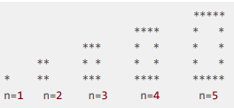
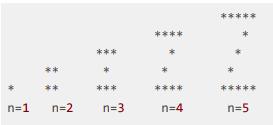
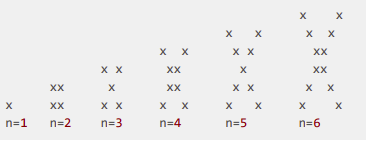
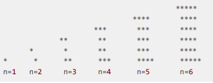
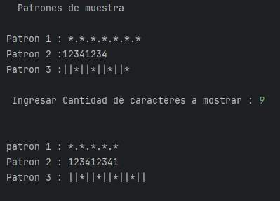
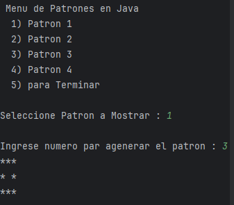

Desafío - Patrones
---

En este desafío validaremos nuestros conocimientos vistos en las sesiones anteriores.
Lee todo el documento antes de comenzar el desarrollo individual o grupal, para asegurarte
de tener el máximo de puntaje y enfocar bien los esfuerzos.

Requerimientos
Resolver cada uno de los siguientes ejercicios
1. Ejercicio 1 - Patrones
   (4 Puntos)
2. Ejercicio 2 - Patrones anidados
   (6 Puntos)

Consideraciones y recomendaciones
-   Revisa en detalle cada requerimiento que viene a continuación:
   
Ejercicio 1 - Patrones
-

   En este desafío se deberá identificar los patrones mostrados a continuación para luego
   dibujar cada uno de ellos.
   
Patrón 1
-     *.*.*.*.*.*.*

Patrón 2
-     12341234 

Patrón 3
-     ||*||*||*||*

   a) Crear un programa Patrones.java donde se deberán mostrar los tres patrones presentados.
      (3 Puntos).
- 
   b) El usuario debe ingresar un número n, el cual indicará cuántos caracteres se deben mostrar.
      (1 Punto).
         
Ejercicio 2 - Patrones anidados
-
   En este ejercicio se deberá identificar los patrones mostrados a continuación para luego
   dibujar cada uno de estos patrones.
   También se deberá utilizar métodos para cada uno de estos patrones.

Patrón 1

 

Patrón 2

 

Patrón 3

Patrón 4

   a) Crear un programa PatronesAnidados.java, donde se deberán mostrar los cuatro
      patrones presentados.(4 Puntos)

   b) El usuario debe ingresar un número n, el cual indicará el dibujo que se debe mostrar. (1 Punto)
   
   c) Crear un método para la resolución de cada uno de los patrones.(1 Punto)
   

Resultado
-

-  Se Adjuntan Algunas imagenes del resultado poropuesto

  - imagen 1 

-  imagen 2

